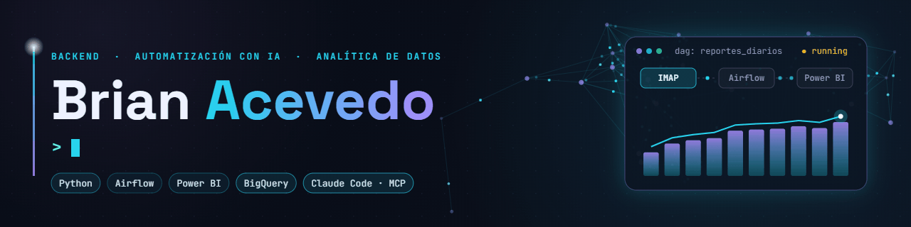

  

  

  <!-- Agrega aquí tus enlaces de contacto, por ejemplo:
  
  
  -->
  
  

---

### 🧭 Sobre mí

Mi trabajo combina **desarrollo backend, automatización con IA y analítica de datos**: construyo soluciones que reducen carga operativa y ayudan a tomar mejores decisiones con la información disponible.

- 📊 **Analítica de datos** — Diseño pipelines con **Apache Airflow** que automatizan la consolidación de reportes operativos (+10 reportes diarios vía IMAP), reduciendo el procesamiento manual y habilitando dashboards en **Power BI** para decisiones de negocio. También he liderado diagnósticos analíticos a gran escala, como un estudio de gobernanza de IA con **121 encuestas**, del que salieron reportes ejecutivos de riesgo.
- 🤖 **Automatización con IA** — Desarrollo automatizaciones con **Python** y agentes de IA (**Claude Code, MCP**) que conectan sistemas operativos con flujos de decisión: desde RPA con **Playwright** hasta bots de mensajería a escala.
- 💡 **Infraestructura** — Administración de servidores **Windows Server**, bases de datos **SQL** y despliegue de soluciones en la nube.

> 🔭 Actualmente enfocado en construir soluciones de analítica y automatización con IA que conecten datos operativos con decisiones de negocio.

### 👨‍💻 Tecnologías

  

  
  
  
  
  
  
   
  
  
  
  
  
  

<table>
  <tr>
    <td width="50%" valign="top">

### 🎓 Formación

- Técnico en Sistemas — **SENA**
- Tecnólogo en Sistemas — **SENA**
- Ingeniería de Sistemas — **Comfamiliar**

</td>
    <td width="50%" valign="top">

### 🌩️ Certificaciones

- **Claude Code in Action** — Anthropic
- Cursos de IA aplicada — **OpenAI**
- **Scrum Foundation** — Certiprof
- **Transformación Digital** — CPE

</td>
  </tr>
</table>

### 📈 Estadísticas

  
  

  

### 🐍 Contribuciones

  <picture>
    <source media="(prefers-color-scheme: dark)" srcset="https://raw.githubusercontent.com/brianacevedo2001-lab/brianacevedo2001-lab/output/github-snake-dark.svg">
    <source media="(prefers-color-scheme: light)" srcset="https://raw.githubusercontent.com/brianacevedo2001-lab/brianacevedo2001-lab/output/github-snake.svg">
    
  </picture>

Datos operativos → decisiones de negocio. ✦

